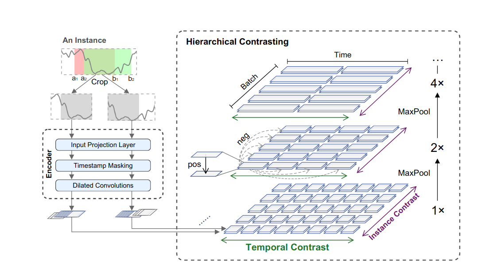

# TS2Vec: Towards Universal Representation of Time Series

## 目录

- [1. 简介]()
- [2. 数据集和复现精度]()
- [3. 准备数据与环境]()
    - [3.1 准备环境]()
    - [3.2 准备数据]()
    - [3.3 准备模型]()
- [4. 开始使用]()
    - [4.1 模型训练]()
    - [4.2 模型评估]()
    - [4.3 模型预测]()
- [5. 自动化测试脚本]()
- [6. LICENSE]()
- [7. 参考链接与文献]()


## 1. 简介

**论文:** [TS2Vec: Towards Universal Representation of Time Series](https://arxiv.org/abs/2106.10466)

**参考repo:** https://github.com/yuezhihan/ts2vec



论文结构如上图所示，TS2Vec执行对比分析在增强的上下文视图上以分层方式学习，这使得能够针对每个对象进行鲁棒的上下文表示时间戳。

从一个in序列中随机抽取两个重叠的子序列-把时间序列放在xi身上，鼓励语境的一致性公共段上的表示。原始输入被馈送输入到编码器中，该编码器与时间对比度损失和实例对比度损失。总数损失在分层框架中的多个尺度上求和工作 ，实验表明，这种结构模型能得到显著的优越特性。

最后在此非常感谢`yuezhihan`等人贡献的[Ts2Vec](https://github.com/yuezhihan/ts2vec)，提高了本repo复现论文的效率。

**aistudio体验教程:** [地址](https://aistudio.baidu.com/aistudio/projectdetail/4413830)


## 2. 数据集和复现精度

格式如下：

- 数据集大小：两个有关时间序列的csv文件，分别为ETTh1和ETTm1
- 数据集下载链接：因为文件小，直接在本地文件夹可找到
- 数据格式：csv

## 3. 准备数据与环境

- 硬件：无要求

- 框架：
  - PaddlePaddle >= 2.2.0
  - Paddlets >= 0.1.0

- 安装指令：

  ```
  python setup.py install
  ```

### 3.2 准备数据

数据在datasets文件夹下


### 3.3 准备模型


预训练模型准备好了，在./output文件夹下


## 4. 开始使用


### 4.1 模型训练

训练命令：

```
python -u tools/train.py ETTh1 forecast_univar --loader forecast_csv_univar --repr-dims 320 --train_model_name latest.pdparams  --epochs=200
```

超参数在tools/train.py已经解释的很清楚

训练结果：

ETTh1:


### 4.2 模型评估

ETTh1:

```
python -u tools/eval.py ETTh1 forecast_univar --loader forecast_csv_univar --repr-dims 320 --train_model_name latest.pdparams  --epochs=200
```


ETTm1:

```
python -u tools/eval.py ETTm1 forecast_univar --loader forecast_csv_univar --repr-dims 320 --train_model_name latest.pdparams  --epochs=200
```

## 5. 自动化测试脚本

参考[test_tipc](./test_tipc/readme.md)


## 6. LICENSE

本项目的发布受[Apache 2.0 license](./LICENSE)许可认证。

## 7. 参考链接与文献

**论文:** [TS2Vec: Towards Universal Representation of Time Series](https://arxiv.org/abs/2106.10466)

**参考repo:** https://github.com/yuezhihan/ts2vec

再次衷心的致谢百度飞桨给予我这次宝贵的经验，以及原作者repo的精巧编写。

不胜感激！
